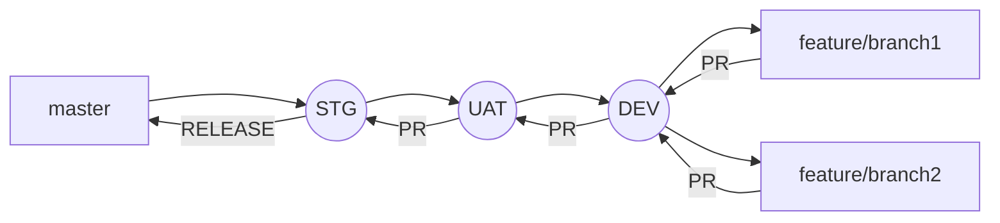

# GIT Basics for Tamimah Development

Git is a version control system that intelligently tracks changes in files. Git is particularly useful when you and a group of people are all making changes to the same files at the same time.

Typically, to do this in a Git-based workflow, you would:

-   **Create a branch** off from the main copy of files that you (and your collaborators) are working on.
-   **Make edits** to the files independently and safely **on your own personal branch**.
-   Let Git intelligently **merge your specific changes** back into the **main copy of files**, so that your changes don't impact other people's updates.
-   Let Git **keep track** of your and other people's changes, so you all stay working on the most up-to-date version of the project.


# Rules
Remember the below rules when you work on GIT

## Never work on `main/master` branch

Working directly on the `main` or `master` branch is risky and generally discouraged because it serves as the **stable** and **production-ready** version of the codebase. 

Any changes made directly to these branches can introduce bugs or unintended issues that might affect the entire project. Instead, it is best to create separate branches for new features, bug fixes, or hotfixes. This approach allows for thorough testing and code review in isolation before merging changes into the main or master branch, ensuring the overall stability and reliability of the project


# Git Basics Documentation

## Table of Contents

1.  Introduction
    
2.  Branching Strategy
    
3.  Common Git Commands
    
    -   Pull
    -   Push
    -   Merge
    -   Checkout
    -   Stash
4.  Using Git with VSCode
    
5.  Using Git with Visual Studio 2022
    

## Introduction

Git is a distributed version control system that helps developers collaborate on projects. It tracks changes, allows multiple people to work on the same codebase, and helps manage code versions.

## Branching Strategy

The branching strategy we'll follow includes:

-   `master`: The main branch.
    
-   `STG` (Staging): For pre-production.
    
-   `UAT` (User Acceptance Testing): For testing by end-users.
    
-   `DEV` (Development): For active development.
    
-   From the `DEV` branch, developers can create their own feature branches.
    

Here's a diagram to visualize this strategy:



## Common Git Commands

### Pull

Pull changes from the remote repository.

sh

```
git pull origin <branch_name>
```

### Push

Push changes to the remote repository.

sh

```
git push origin <branch_name>
```

### Merge

Merge branches to integrate changes.

sh

```
git merge <branch_name>

```

### Checkout

Switch between branches.

sh

```
git checkout <branch_name>

```

### Stash

Save changes temporarily.

sh

```
git stash
git stash pop  # To retrieve stashed changes

```

## Using Git with VSCode

1.  **Install Git:** Make sure Git is installed on your system. Download from git-scm.com.
    
2.  **Open VSCode:** Launch Visual Studio Code.
    
3.  **Open the Terminal:** Navigate to `View > Terminal` or press `Ctrl+` (backtick).
    
4.  **Initialize Repository:** In the terminal, navigate to your project directory and run:
    
    sh
    
    ```
    git init    
    ```
    
5.  **Add Remote Repository:**
    
    sh
    
    ```
    git remote add origin <repository_url>    
    ```
    
6.  **Commit Changes:**
    
    -   Stage changes: `git add .`
        
    -   Commit: `git commit -m "Initial commit"`
        
7.  **Push Changes:**
    
    sh
    
    ```
    git push -u origin master    
    ```
    
8.  **Using the Source Control Panel:**
    
    -   Click on the Source Control icon on the left sidebar.
        
    -   You can stage, commit, and push changes directly from the Source Control panel.
        

## Using Git with Visual Studio 2022

1.  **Install Git:** Make sure Git is installed on your system. Download from git-scm.com.
    
2.  **Open Visual Studio 2022:** Launch Visual Studio.
    
3.  **Clone Repository:**
    
    -   Go to `File > Open > Open from Source Control`.
        
    -   Enter the repository URL and click `Clone`.
        
4.  **Initialize Repository:**
    
    -   If starting a new project, create or open your project.
        
    -   Go to `Git > Create Git Repository` to initialize a new repository.
        
5.  **Commit Changes:**
    
    -   Open the `Git Changes` window from `View > Git Changes`.
        
    -   Stage changes by clicking the `+` icon next to the file.
        
    -   Enter a commit message and click `Commit All`.
        
6.  **Push Changes:**
    
    -   In the `Git Changes` window, click `Push` to push changes to the remote repository.
        
7.  **Pull Changes:**
    
    -   Click `Pull` in the `Git Changes` window to fetch and merge changes from the remote repository.
        
8.  **Create and Switch Branches:**
    
    -   Go to `Git > Manage Branches`.
        
    -   Create a new branch or switch to an existing branch.
