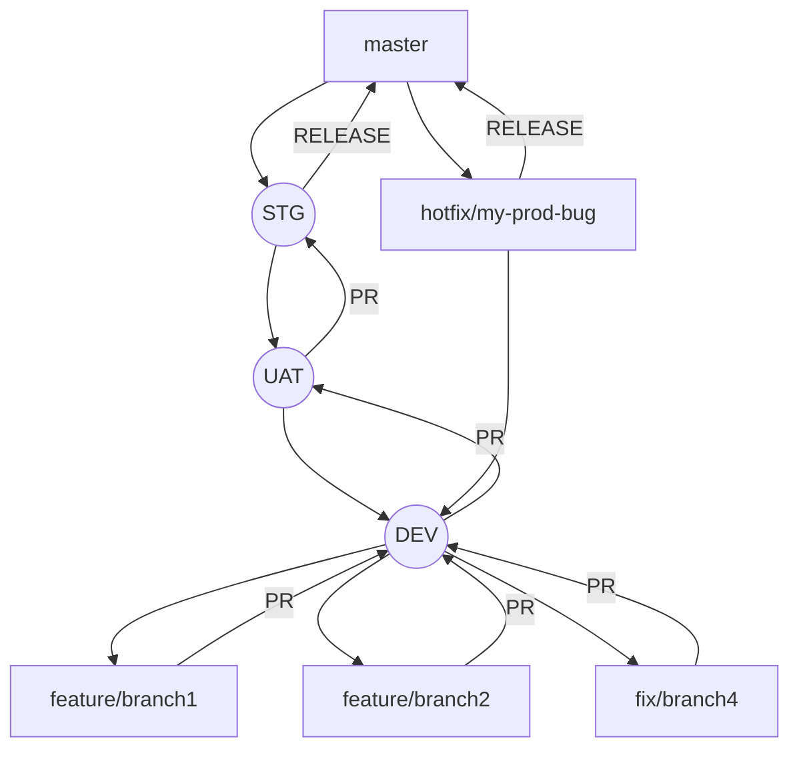

# GIT Basics for Tamimah Development

Git is a version control system that intelligently tracks changes in files. Git is particularly useful when you and a group of people are all making changes to the same files at the same time.

Typically, to do this in a Git-based workflow, you would:

-   **Create a branch** off from the main copy of files that you (and your collaborators) are working on.
-   **Make edits** to the files independently and safely **on your own personal branch**.
-   Let Git intelligently **merge your specific changes** back into the **main copy of files**, so that your changes don't impact other people's updates.
-   Let Git **keep track** of your and other people's changes, so you all stay working on the most up-to-date version of the project.

## Table of Contents

1. Rules 
    
2.  Branching Strategy
    
3.  Common Git Commands
    
    -   Pull
    -   Push
    -   Merge
    -   Checkout
    -   Stash
4.  Using Git with VSCode
    
5.  Using Git with Visual Studio 2022

6. Configuring Visual Studio Code as Your Git Merge Tool    


# Rules
Remember the below rules when you work on GIT

## Never work on `main/master` branch

Working directly on the `main` or `master` branch is risky and generally discouraged because it serves as the **stable** and **production-ready** version of the codebase. 

### Branch Management
1. **Use Descriptive Branch Names:** Choose clear, concise names that reflect the purpose of the branch (e.g., `feature/login`, `fix/issue-123`).
2. **Branch Protection:** Protect important branches like `main` and `develop` to prevent direct commits and enforce pull request reviews.
3. **Regular Cleanup:** Periodically delete merged branches once UAT is complete to keep the repository tidy.
4. **Reset Branch:** Never reset your branch unless approved by your manager or TL

### Commit Practices
1. **Write Meaningful Commit Messages:** Summarize changes succinctly in the subject line and provide more detail in the body if necessary. **Use Jira issue number** always as the starting word of the commit message always
2. **Atomic Commits:** Each commit should be a self-contained unit of change that makes sense on its own.
3. **Commit Often:** Make small, frequent commits to make it easier to track changes and revert if needed.
4. **Reset Commit:** Never reset your commit to an older one unless you have a TL/manager approval
5. **Force Push**: Never force push to a branch when GIT refuses your push. Check what is the problem. You probably have a commit or two to pull or have merge conflicts you need to fix before pushing. Fix those before pushing normally. **Never Force Push.**

### Pull Requests
1. **Create Pull Requests for Major Changes:** Always use pull requests once you complete your development for module or task to `DEV` branch.
2. **Use Draft Pull Requests:** Start a pull request early to gather feedback as you work on changes.
3. **Review Thoroughly:** Take the time to review code changes carefully and provide constructive feedback.

### Code Review
1. **Be Respectful:** Provide constructive criticism and recognize good work.
2. **Follow Guidelines:** Ensure code follows established coding standards and best practices.
3. **Test Changes:** Verify that code changes are properly tested before merging.

### General Best Practices
1. **Keep Repositories Clean:** Remove unused files and keep the repository structure organized.
2. **Document Processes:** Maintain documentation for common processes, like branching strategies and release workflows.
3. **Automate Where Possible:** Use CI/CD pipelines to automate testing, building, and deployment processes.


Any changes made directly to these branches can introduce bugs or unintended issues that might affect the entire project. Instead, it is best to create separate branches for new features, bug fixes, or hotfixes. This approach allows for thorough testing and code review in isolation before merging changes into the main or master branch, ensuring the overall stability and reliability of the project


## Branching Strategy

The branching strategy we'll follow includes:

-   `master`: The main branch. In some cases the branch name can be `main` too
    
-   `STG` (Staging): For pre-production.
    
-   `UAT` (User Acceptance Testing): For testing by end-users.
    
-   `DEV` (Development): For active development.
    
-   From the `DEV` branch, developers can create their own feature branches.
    
 ### Naming Strategy

The naming strategy will be as follows:

-   `feature/{branch-name}`: A feauture or module or task branch should always start with the prefix `feature`. Branch name should meaningful according to the feature/module you are developing
    
-   `fix/{branch-name}` : When you are fixing a bug, the prefix of the branch should start with `fix` followed by a branch name which will represent the bug you are fixing
    
-   `hotfix/{branch-name}` : `hotfix` prefix should be used if you are fixing a production bug which needs to be pushed immediately. This will be directly merged to `master` or `STG` branches and remerged to `DEV` branch later. `hotfix` branch must be tested thoroughly and reviewed by the TL before it can be merged to `master` or `STG`
   
Here's a diagram to visualize this strategy:



## Common Git Commands

### Pull

Pull changes from the remote repository.

sh

```
git pull origin <branch_name>
```

### Push

Push changes to the remote repository.

sh

```
git push origin <branch_name>
```

### Merge

Merge branches to integrate changes.

sh

```
git merge <branch_name>

```

### Checkout

Switch between branches.

sh

```
git checkout <branch_name>

```

### Stash

Save changes temporarily.

sh

```
git stash
git stash pop  # To retrieve stashed changes

```

# Using Git with VSCode

1.  **Install Git:** Make sure Git is installed on your system. Download from git-scm.com.
    
2.  **Open VSCode:** Launch Visual Studio Code.
    
3.  **Open the Terminal:** Navigate to `View > Terminal` or press `Ctrl+` (backtick).
    
4.  **Initialize Repository:** In the terminal, navigate to your project directory and run:
    
    sh
    
    ```
    git init    
    ```
    
5.  **Add Remote Repository:**
    
    sh
    
    ```
    git remote add origin <repository_url>    
    ```
    
6.  **Commit Changes:**
    
    -   Stage changes: `git add .`
        
    -   Commit: `git commit -m "Initial commit"`
        
7.  **Push Changes:**
    
    sh
    
    ```
    git push -u origin master    
    ```
    
8.  **Using the Source Control Panel:**
    
    -   Click on the Source Control icon on the left sidebar.
        
    -   You can stage, commit, and push changes directly from the Source Control panel.
        

# Using Git with Visual Studio 2022

1.  **Install Git:** Make sure Git is installed on your system. Download from git-scm.com.
    
2.  **Open Visual Studio 2022:** Launch Visual Studio.
    
3.  **Clone Repository:**
    
    -   Go to `File > Open > Open from Source Control`.
        
    -   Enter the repository URL and click `Clone`.
        
4.  **Initialize Repository:**
    
    -   If starting a new project, create or open your project.
        
    -   Go to `Git > Create Git Repository` to initialize a new repository.
        
5.  **Commit Changes:**
    
    -   Open the `Git Changes` window from `View > Git Changes`.
        
    -   Stage changes by clicking the `+` icon next to the file.
        
    -   Enter a commit message and click `Commit All`.
        
6.  **Push Changes:**
    
    -   In the `Git Changes` window, click `Push` to push changes to the remote repository.
        
7.  **Pull Changes:**
    
    -   Click `Pull` in the `Git Changes` window to fetch and merge changes from the remote repository.
        
8.  **Create and Switch Branches:**
    
    -   Go to `Git > Manage Branches`.
        
    -   Create a new branch or switch to an existing branch.


# Configuring Visual Studio Code as Your Git Merge Tool

## Prerequisites

- Ensure that [Visual Studio Code](https://code.visualstudio.com/) is installed.
- Ensure that [Git](https://git-scm.com/) is installed.

## Step-by-Step Guide

1. **Open Git Configuration**:
   - Open a terminal (Git Bash, Command Prompt, or PowerShell).
   - Open your global Git configuration file with the following command:
     ```bash
     git config --global -e
     ```
   - This command opens your global Git configuration file in the default text editor.

2. **Set VS Code as the Default Merge Tool**:
   - Add the following lines to your Git configuration file to set Visual Studio Code as your default merge tool:
     ```ini
     [merge]
         tool = vscode
     [mergetool "vscode"]
         cmd = code --wait $MERGED
     ```

3. **Set VS Code as the Default Diff Tool (Optional)**:
   - If you also want to use Visual Studio Code as your default diff tool, add the following lines to your Git configuration file:
     ```ini
     [diff]
         tool = vscode
     [difftool "vscode"]
         cmd = code --wait --diff $LOCAL $REMOTE
     ```

4. **Test Your Configuration**:
   - To test the merge tool configuration, create a merge conflict in one of your Git repositories and resolve it using Visual Studio Code.
   - You can invoke the merge tool with the following command:
     ```bash
     git mergetool
     ```
   - Similarly, you can test the diff tool configuration by running:
     ```bash
     git difftool
     ```

5. **Using the Merge Tool**:
   - When you run `git mergetool`, Visual Studio Code will open with the conflicting files.
   - Resolve the conflicts in Visual Studio Code and save the changes.
   - Close Visual Studio Code to let Git know that the merge process is complete.


#### NOTE
You can use the GUI based applications like below too to work on GIT
- GIT Extensions
- GitHub desktop
- Source Tree
- Tortoise GIT
- SmartGit

